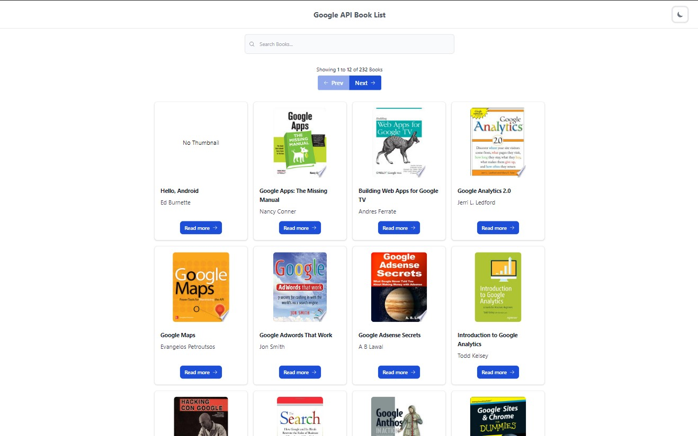
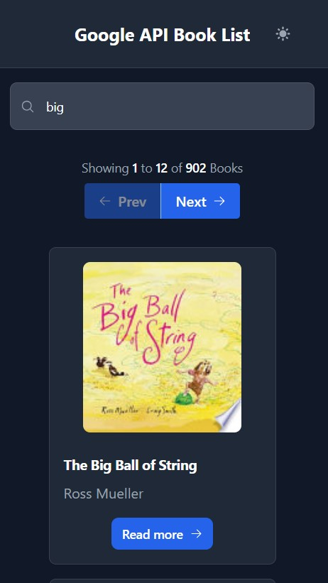
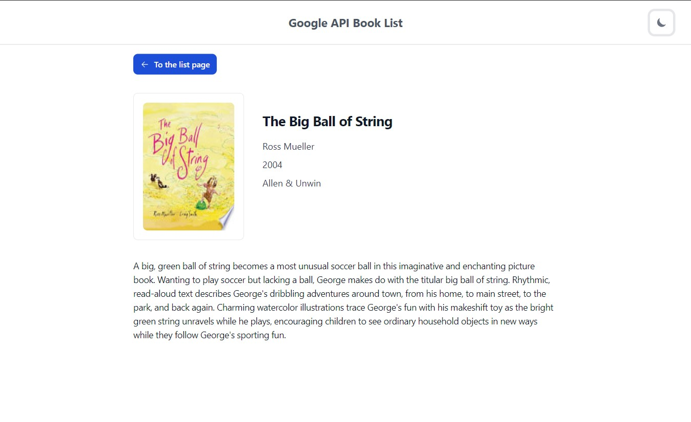
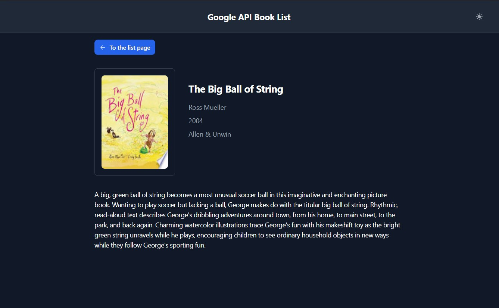
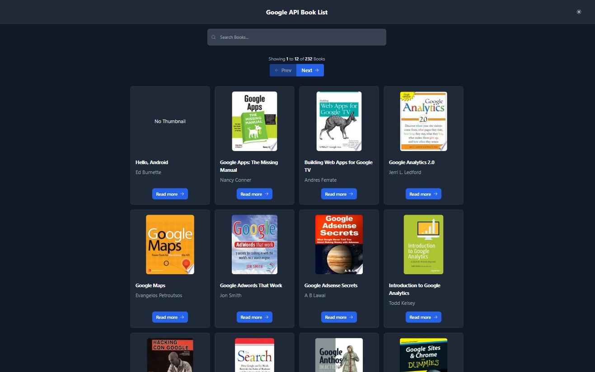

<a name="readme-top"></a>

<!-- PROJECT LOGO -->
<br />
<div align="center">
  <h1 align="center">Google Book List</h1>
  <p align="center">
    A React, Redux, and TypeScript application that allows users to search for and display details of books using Google Book API.
    <br />
    <a href="https://elite0107.github.io/books-list"><strong>Go to the home page »</strong></a>
    <br />
  </p>
</div>

<!-- TABLE OF CONTENTS -->
<details>
  <summary>Table of Contents</summary>
  <ol>
    <li>
      <a href="#about-the-project">About The Project</a>
      <ul>
        <li><a href="#built-with">Built With</a></li>
      </ul>
    </li>
    <li>
      <a href="#getting-started">Getting Started</a>
      <ul>
        <li><a href="#installation">Installation</a></li>
      </ul>
    </li>
    <li><a href="#usage">Usage</a></li>
    <li><a href="#roadmap">Roadmap</a></li>
    <li><a href="#contact">Contact</a></li>
  </ol>
</details>

<!-- ABOUT THE PROJECT -->

## About The Project

<p align="center">
   
</p>
<div style="display: flex; gap: 6%; width: 72%; margin-left: 14%; margin-bottom: 4%">
  
  <div style="width: 50%; display: flex; flex-direction: column; gap: 10%">
    
    
  </div>
</div>
<p align="center">
   
</p>

This application allows users to search and show details of the books from Google Book API.

<p align="right">(<a href="#readme-top">back to top</a>)</p>

### Built With

- ![React][React.js]
- ![Redux][Redux.js]
- ![TypeScript][TypeScript]
- ![Tailwind][Tailwind]
- ![Jest][Jest]
- ![Cypress][Cypress]
- ![GitHubActions][GitHubActions]
- ![GitHubPages][GitHubPages]

<p align="right">(<a href="#readme-top">back to top</a>)</p>

<!-- GETTING STARTED -->

## Getting Started

Deployed website:
[https://elite0107.github.io/books-list](https://elite0107.github.io/books-list)

### Installation

1. Get a free Google Book API Key from your Google account.
2. Clone the repo
   ```sh
   git clone https://github.com/elite0107/books-list.git
   ```
3. Install NPM packages
   ```sh
   yarn
   ```
4. Enter your API in `.env.local`
   ```sh
   REACT_APP_USER_KEY=YOUR_GOOGLE_BOOK_API_KEY
   ```
5. Build the website
   ```sh
   yarn build
   ```
6. Test the website
   ```sh
   yarn test
   ```
7. Deploy the website
   ```sh
   yarn deploy
   ```

<p align="right">(<a href="#readme-top">back to top</a>)</p>

<!-- USAGE EXAMPLES -->

## Usage

Users can search and display books from `Google Books API`.
I implemented debouncing of the search results to avoid ovarloading the API.<br/>
Used `local storage` to save `color mode (dark|light)`, `user search query`, and `start number of pagination`. So when the user revisits the application, these settings are restored then users can show the last search results.
<br/>
Built responsive designs that are compotable for desktop and mobile views and theme switching feature. At first time, the application collects the user's device's color mode and set the application's color mode.
<br/>
Implemented some simple `unit`, `integration`, and `e2e` testings by `Jest` and `Cypress`. Mocked `Redux` and `Web Requests` to test the pages and components. Used `advanced timer` to test debouncing.
<br/>
Utilized `Github actions` and `Github pages` to implement `CI/CD` pipeline.
So when developers push codes or make a pull request to `master` branch, `Github actions` run automatically to test the code and deploy the build results to `Github pages`.

<p align="right">(<a href="#readme-top">back to top</a>)</p>

<!-- ROADMAP -->

## Roadmap

- [x] Search books
- [x] Debouncing search feature
- [x] Every search result has title and cover image
- [x] Navigate to the book detail page by clicking `ReadMore` button
- [x] Display detailed information of a book
- [x] Use Redux for state management
- [x] Keep search queries and pagination values in the Redux store
- [x] Handle loading, error, and success status
- [x] Build responsive designs that work on both desktop and mobile views
- [x] Use TailwindCSS to build UI components
- [x] Implement pagination for the search results
- [x] Save user's last search and pagination in local storage to save and restore history
- [x] Implement unit, integration and e2e testing by Jest and Cypress
- [x] Build CI/CD pipeline by github actions and github pages
- [x] Deploy the website to [https://elite0107.github.io/books-list](https://elite0107.github.io/books-list)

<p align="right">(<a href="#readme-top">back to top</a>)</p>

<!-- CONTACT -->

## Contact

elite0107 - toptalent0107@gmail.com

Project Link: [https://github.com/elite0107/books-list](https://github.com/elite0107/books-list)

<p align="right">(<a href="#readme-top">back to top</a>)</p>

<!-- MARKDOWN LINKS & IMAGES -->
<!-- https://www.markdownguide.org/basic-syntax/#reference-style-links -->

[React.js]: https://img.shields.io/badge/React-20232A?style=for-the-badge&logo=react&logoColor=61DAFB
[Redux.js]: https://img.shields.io/badge/Redux-593D88?style=for-the-badge&logo=redux&logoColor=white
[TypeScript]: https://img.shields.io/badge/TypeScript-007ACC?style=for-the-badge&logo=typescript&logoColor=white
[Tailwind]: https://img.shields.io/badge/Tailwind_CSS-38B2AC?style=for-the-badge&logo=tailwind-css&logoColor=white
[Jest]: https://img.shields.io/badge/Jest-323330?style=for-the-badge&logo=Jest&logoColor=white
[Cypress]: https://img.shields.io/badge/Cypress-17202C?style=for-the-badge&logo=cypress&logoColor=white
[GitHubActions]: https://img.shields.io/badge/GitHub_Actions-2088FF?style=for-the-badge&logo=github-actions&logoColor=white
[GitHubPages]: https://img.shields.io/badge/GitHub%20Pages-222222?style=for-the-badge&logo=GitHub%20Pages&logoColor=white
